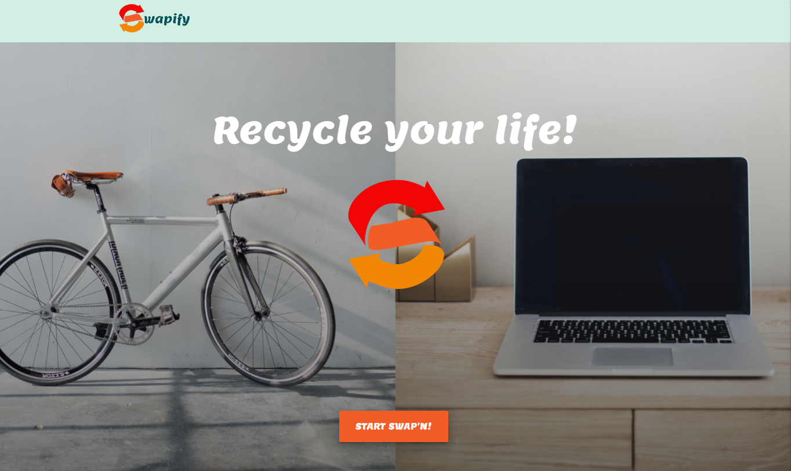
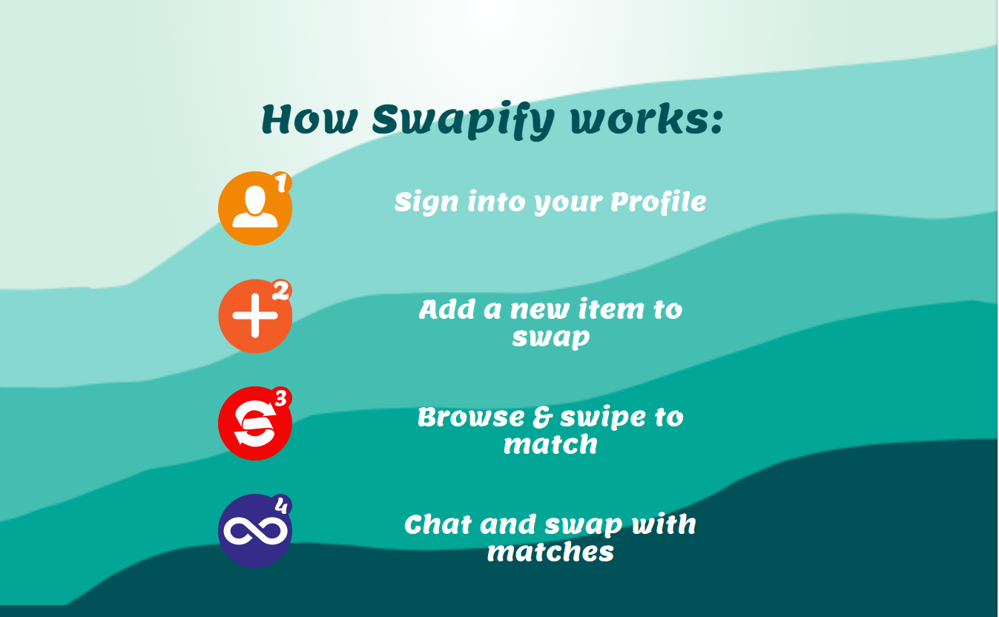
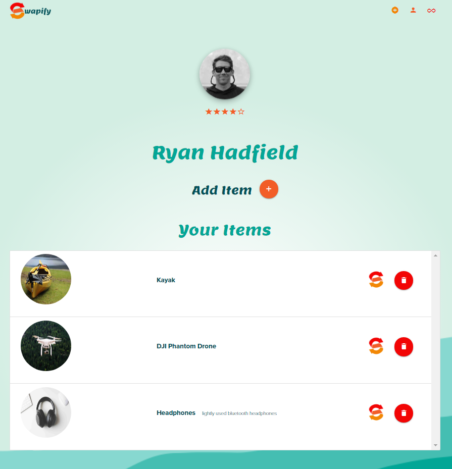
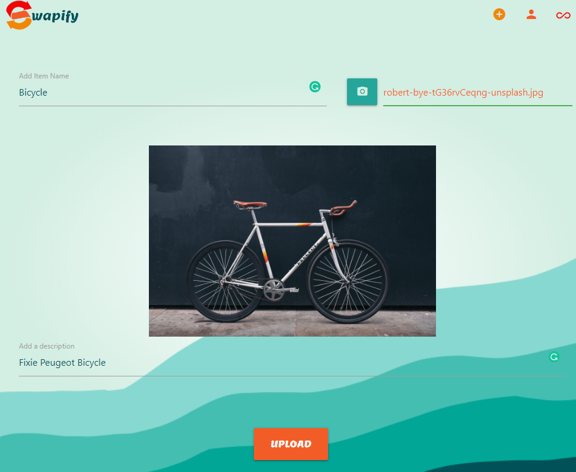
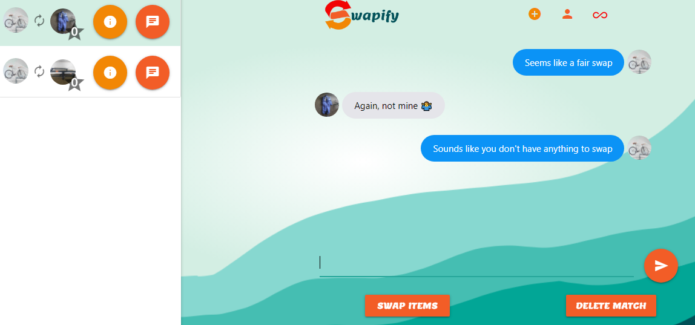

<p align="center">

</p>

# Swapify

### Swapify is a React App that allows users to list, connect, and swap items with other nearby users in an easy to use and intuitive web application.

---

## Description

 Swapify allows users can upload images and descriptions of items they are looking to swap onto their profile.  Users can browse our database of other swappable items in a simple, fun and familiar UI.  Once a match is made by users both selecting each other's items both parties are alerted of the match. The users are then able to use our swap-chat feature to communicate with one another and sort out the details of the swap.  Once the swap has been made each user can rate the other on the experience and add to their Swapify rating.  Enjoy & Get Swap'n!

This app is deployed on [Heroku](https://swapify-us.herokuapp.com/).


---

## Table of Contents (Optional)

- [About](#Swapify)
- [Technology](#Built-With)
- [Installation](#Starting-the-app-locally)
- [Usage](#usage)
- [Links](#links)
- [License](#license)
- [Contact](#questions)

---

## Built With

- [React](https://reactjs.org/)
- [PassportJS](http://www.passportjs.org/)
- [NodeJS](https://nodejs.dev/)
- [ExpressJS](https://expressjs.com/)
- [Axios](https://axios-http.com/)
- [Firebase](https://firebase.google.com/)
- [Mongo DB](https://www.mongodb.com/)
- [Google OAuth](https://developers.google.com/identity)
- [Mongoose](https://mongoosejs.com/)
- [RC Slider](https://www.npmjs.com/package/rc-slider)
- [react-dom-confetti](https://www.npmjs.com/package/react-dom-confetti)
- [React Rating](https://www.npmjs.com/package/react-rating)
- [React Materialize](http://react-materialize.github.io/react-materialize/?path=/story/react-materialize--welcome)
- [Materialize CSS](https://materializecss.com/)
- [Google Fonts](https://fonts.google.com/)
- [Favicon](https://favicon.io/)
- [Reducer](https://www.npmjs.com/package/reducer)
- [Compressor.js](https://www.npmjs.com/package/compressorjs)
- [React Google Login](https://www.npmjs.com/package/react-google-login)
- [Material Icons](https://material-ui.com/components/material-icons/)
- [Framer Motion](https://www.framer.com/motion/)
- [Tool Tip](https://www.npmjs.com/package/react-tooltip)


Our setup allows for a Node/Express/React app which can be easily deployed to Heroku.

The front-end React app will auto-reload as it's updated via webpack dev server, and the backend Express app will auto-reload independently with nodemon.


---
## Starting the app locally

Start by installing front and backend dependencies. While in this directory, run the following command:

```
npm install
```

This should install node modules within the server and the client folder.

After both installations complete, run the following command in your terminal:

```
npm start
```

Your app should now be running on <http://localhost:3000>. The Express server should intercept any AJAX requests from the client.

---

## Usage

- Users login to the site using their Google login info. 
 




- The user is able to add items, with images, and descriptions to their profile page to swap with other people.



- The user adds an item they would like swap



- Once a user's item matches with another user they are directed to the swap-chat page where they can communicate the details of the swap.



---

## Links
* [Github](https://github.com/pfvatterott/Swapify)
* [Heroku](https://swapify-us.herokuapp.com/)

---
## License

MIT License

Copyright (c) 2021 Paul Vatterott, Kelly Henderson, & Ryan Hadfield

Permission is hereby granted, free of charge, to any person obtaining a copy of this software and associated documentation files (the "Software"), to deal in the Software without restriction, including without limitation the rights to use, copy, modify, merge, publish, distribute, sublicense, and/or sell copies of the Software, and to permit persons to whom the Software is furnished to do so, subject to the following conditions:

The above copyright notice and this permission notice shall be included in all copies or substantial portions of the Software.

THE SOFTWARE IS PROVIDED "AS IS", WITHOUT WARRANTY OF ANY KIND, EXPRESS OR IMPLIED, INCLUDING BUT NOT LIMITED TO THE WARRANTIES OF MERCHANTABILITY, FITNESS FOR A PARTICULAR PURPOSE AND NONINFRINGEMENT. IN NO EVENT SHALL THE AUTHORS OR COPYRIGHT HOLDERS BE LIABLE FOR ANY CLAIM, DAMAGES OR OTHER LIABILITY, WHETHER IN AN ACTION OF CONTRACT, TORT OR OTHERWISE, ARISING FROM, OUT OF OR IN CONNECTION WITH THE SOFTWARE OR THE USE OR OTHER DEALINGS IN THE SOFTWARE.

---
## Authors

### Paul Vatterott

[Github](https://github.com/pfvatterott) <br>
Email: pfvatterott@gmail.com

<br>

### Kelly Henderson
[Github](https://github.com/khendersonPC) <br>
Email: khenderson@pcschools.us

<br>

### Ryan Hadfield

[Github](https://github.com/ryanhadfield) <br>
Email: ryan.hadfield@gmail.com
